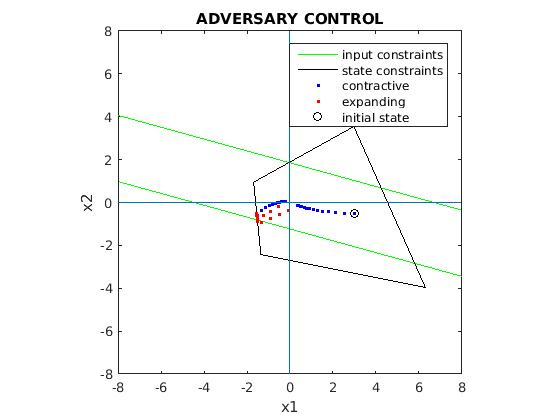
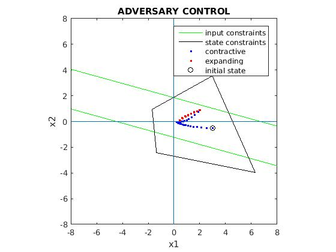
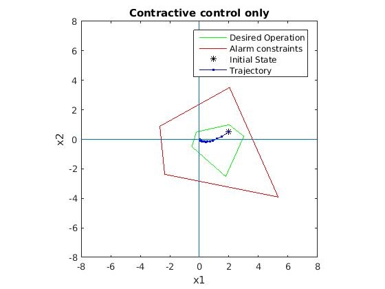
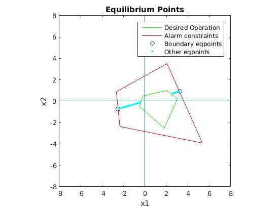
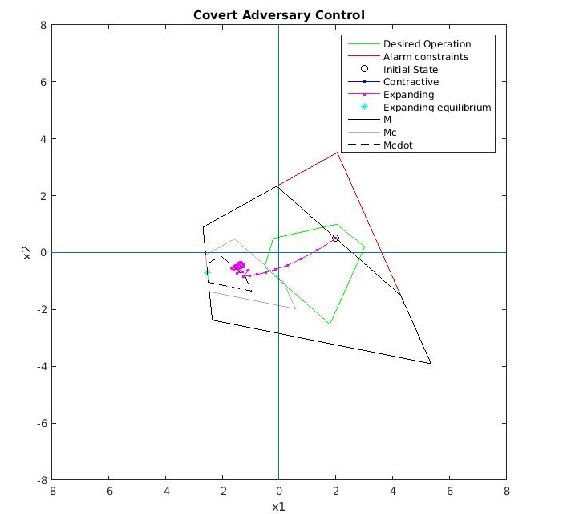
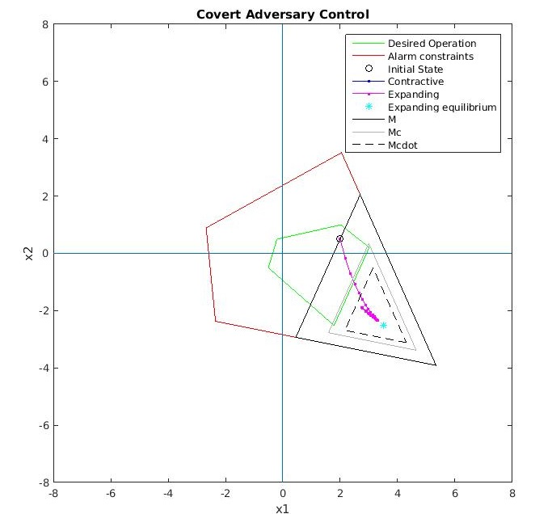
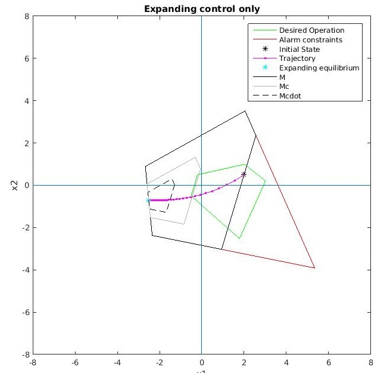
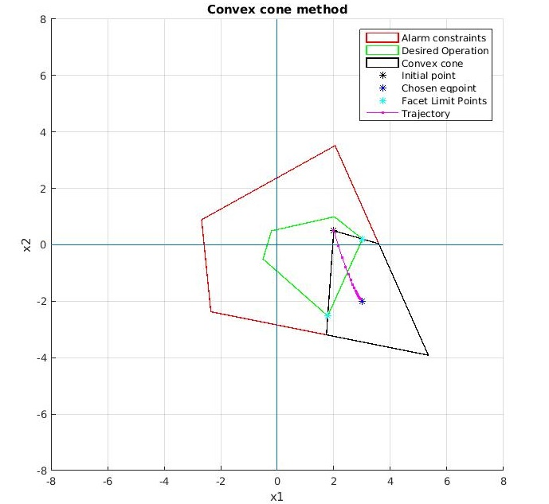

# Adversary Control

## Overview

Simulation of adversary control in a linear, 2-dimensional discrete system in state-space representation.

We assume that the system operates under linear constraints regarding both the input of the controllers and regarding its state. Depending on the type of scenario (see below) a specific area is defined, called the desired operation area, within which the system wants to operate.

The system is controlled by two opposing parties : The contractive and the expanding controllers.
The objective of the contractive controller is to keep the system operating in a stable equilibrium point within the desired operation area , while the objective of the expanding controller is to disrupt this stability and force it to operate outside
of it (while respecting input constraints).

The following scenarios of adversary control are explored :

*Regular* : The desired operation area is defined as the intersection of the input constraints and the state constraints. The two controllers take turns affecting the system for a preset amount of time steps.

*Covert* : In the case of covert adversary control, two areas are defined : the alarm constraints area and the desired operation area (the second being a subset of the first). The objectives of the expanding controller in this case, is to force the system to a equilibrium point outside the desired operation area while respecting the alarm constraints, and with the minimum amount of time spent controlling the system.

## Theoretical Background

The fundamental mathematical concepts utilized by this simulation can be found in the following papers:

> * **Georges Bitsoris**, **On the positive invariance of polyhedral sets for discrete-time systems**  
Systems & Control Letters, Volume 11, Issue 3, 1988, Pages 243-248, ISSN 0167-6911  
> [DOI link to article](https://doi.org/10.1016/0167-6911(88)90065-5)

> * **Vassilaki, M., Hennet, J. C., & Bitsoris, G.** (1988).  
**Feedback control of linear discrete-time systems under state and control constraints**.  
International Journal of Control, 47(6), 1727–1735.  
> [ResearchGate link](https://www.researchgate.net/publication/245321522_Feedback_Control_of_Discrete-time_Systems_under_State_and_Control_Constraints)  
> [DOI link](https://doi.org/10.1080/00207178808906132?urlappend=%3Futm_source%3Dresearchgate.net%26utm_medium%3Darticle)

This simulation is based, and extends upon, the following papers:

> * **E. Kontouras, A. Tzes and L. Dritsas**,   
**Adversary control strategies for discrete-time systems**,  
2014 European Control Conference (ECC), Strasbourg, France, 2014, pp. 2508-2513  
> [ResearchGate link](https://www.researchgate.net/publication/269292502_Adversary_control_strategies_for_discrete-time_systems)  
> [DOI link](https://doi.org/10.1109/ECC.2014.6862519)

> * **E. Kontouras, A. Tzes and L. Dritsas**,  
**Covert attack on a discrete-time system with limited use of the available disruption resources**,  
2015 European Control Conference (ECC), Linz, Austria, 2015, pp. 812-817  
> [ResearchGate link](https://www.researchgate.net/publication/301454114_Covert_attack_on_a_discrete-time_system_with_limited_use_of_the_available_disruption_resources)  
> [DOI link](https://doi.org/10.1109/ECC.2015.7330642)

### Convex Cone method

This method is used when the expanding controller must force the state of the system through a specific facet of the desired operation area, in order to reach the chosen equilibrium point.  
In this case, the following procedure is followed:

* The convex hull of the chosen facet's vertices plus the initial point, is calculated. It is then converted in H-representation (system of linear inequalities).

* From the linear inequalities , we remove the one which will cause the remaining to represent a convex cone , starting from the initial point and facing towards the chosen facet and beyond.

* Via a theorem described in the papers (see above) , we calculate a suitable gain factor so that the equilibrium point (which resides within the convex cone) is reached in the least amount of time steps.

## How to run

Before running, unzip the 'tbxmanager' folder. The 'tbxmanager' folder contains the MPT3 library. The simulation can then be executed by running the 'SIMULATION.m' file via MATLAB. The rest of the folders contain the definitions of the functions used by the simulation .

## Features

* Default input data, for testing purposes.

* Choice of 3 methods for expanding controller, in the covert case.

* Option to show all candidate equilibrium points for expanding controller, in the covert case .

* Option to introduce uncertainty in the state position for the expanding controller, in the regular case.

## Screenshots

## Dependencies

This simulation uses the 'Multi-Parametric Toolbox 3 (MPT3)' library for the calculation and
plotting of the convex cone.

It will also be used in the future, for the solution of the linear and nonlinear programming problems
in the case of multi-dimensional systems.

MPT3 is licensed under GPL.

( http://people.ee.ethz.ch/~mpt/3/ )

## License

This simulation is distributed under Apache License Version 2.0

Copyright (C) 2017 Stylianos Tsiakalos
